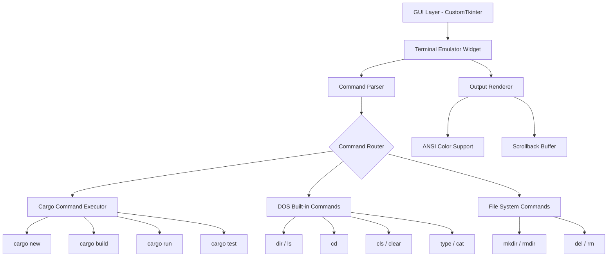
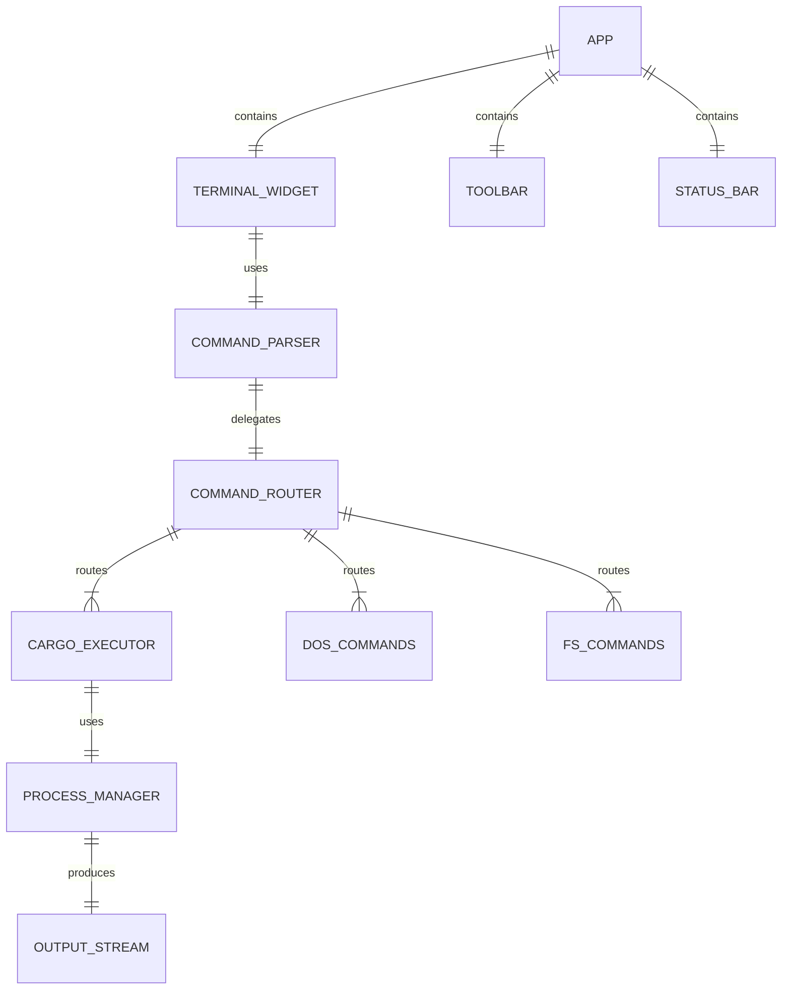

# Rust Cargo DOS Commander - 项目设计文档

## 1. 系统架构

## 2. 模块设计

## 3. 核心功能清单

| 模块 | 功能 | 说明 |
|------|------|------|
| Terminal Widget | DOS风格终端 | 黑底绿字，支持命令历史 |
| Cargo Commands | cargo new | 创建Rust项目 |
| Cargo Commands | cargo build | 编译Rust项目 |
| Cargo Commands | cargo run | 运行Rust项目 |
| Cargo Commands | cargo test | 测试Rust项目 |
| Cargo Commands | cargo check | 检查Rust项目 |
| DOS Commands | dir | 列出目录内容 |
| DOS Commands | cd | 切换目录 |
| DOS Commands | cls | 清屏 |
| DOS Commands | type | 查看文件内容（.rs文件带语法高亮） |
| DOS Commands | mkdir/rmdir | 创建/删除目录 |
| DOS Commands | del | 删除文件 |
| DOS Commands | help | 帮助信息 |
| DOS Commands | toml | 打开Cargo.toml可视化编辑器 |
| GUI | 工具栏 | 快捷按钮(新建/编译/运行) |
| GUI | 状态栏 | 当前目录/Rust版本 |
| GUI | 命令历史 | 上下键浏览历史 |
| GUI | 文件浏览器 | 左侧面板，树形展示项目结构 |
| GUI | 命令自动补全 | Tab键触发，支持命令/路径/cargo选项 |
| GUI | 语法高亮 | Rust关键字/类型/字符串/注释着色 |
| GUI | Cargo.toml编辑器 | 表单式编辑包信息和依赖 |
| GUI | 多标签终端 | 独立会话，Ctrl+T新建标签 |

## 4. UI/UX 规范

- **主色调**: DOS经典黑底 `#0C0C0C`, 文字绿 `#00FF00`
- **辅助色**: 错误红 `#FF5555`, 警告黄 `#FFFF55`, 信息蓝 `#5555FF`
- **字体**: `Consolas` / `Courier New` 14px
- **窗口**: 最小 1024x768, 可调整大小
- **提示符**: 模拟DOS风格 `C:\project_path>`
- **工具栏**: 深灰背景 `#2D2D2D`, 按钮带hover高亮
- **文件浏览器**: 左侧面板 `#1E1E1E`, 树形结构, 文件图标
- **多标签栏**: 终端顶部标签切换, 活跃标签高亮
- **自动补全**: 浮动弹窗 `#1E1E1E`, 蓝色选中高亮
- **语法高亮**: VS Code风格配色 (关键字蓝/类型青/字符串橙/注释绿)

## 5. 快捷键

| 快捷键 | 功能 |
|--------|------|
| Tab | 命令自动补全 |
| ↑/↓ | 浏览命令历史 |
| Ctrl+C | 取消运行/清除输入 |
| Ctrl+L | 清屏 |
| Ctrl+T | 新建终端标签 |
| Ctrl+B | 切换文件浏览器 |
| Ctrl+E | 打开Cargo.toml编辑器 |
| Escape | 关闭自动补全弹窗 |
